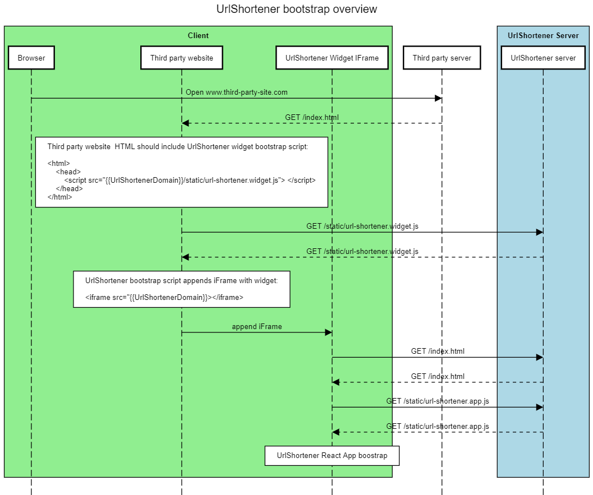
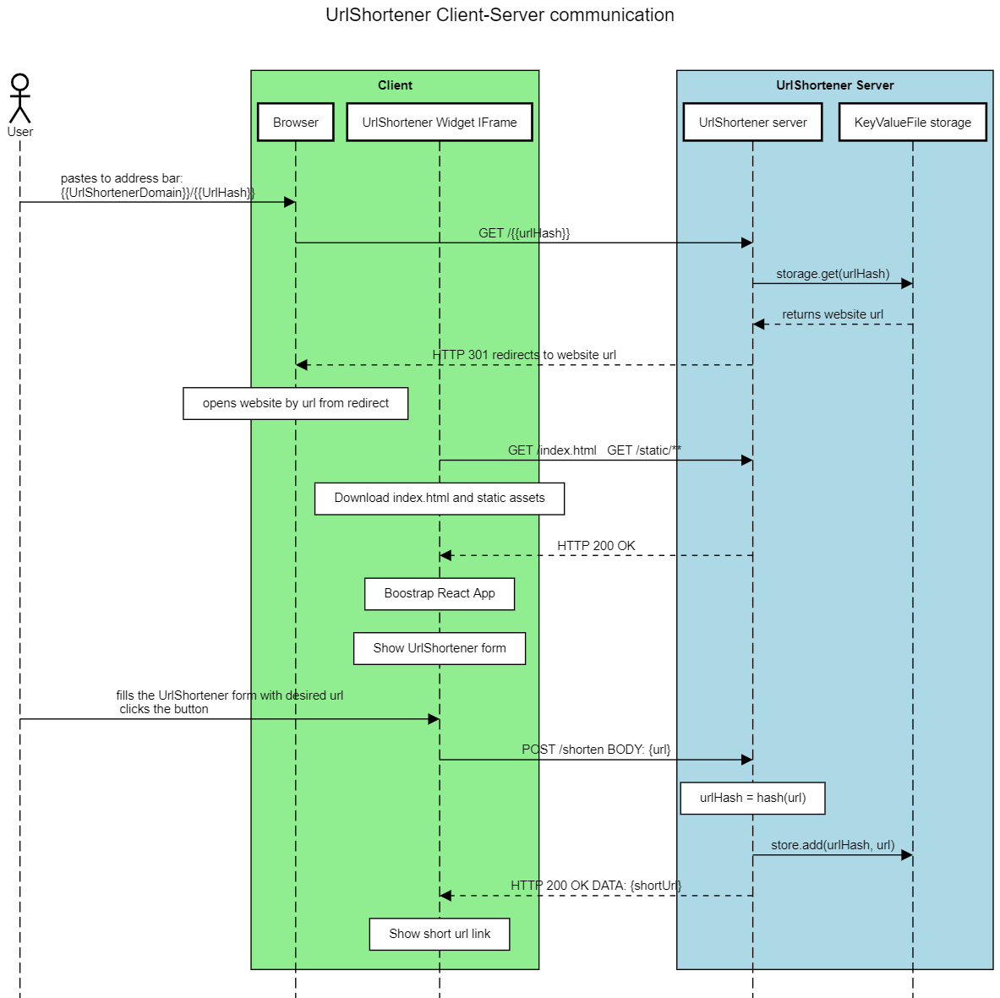

# UrlShortener App
##  Overview

This repository contains the code for UrlShortener showcase app.

The repo contains:
 * a client widget in `/frontend` directory, to be written in React - currently only widget bootstrapping available
 * a server in `/server` directory, written in Node.js (Express)
 * demo website connecting the two parts above, located in `/demo` directory
 
 Checklist - features to complete:
 1. ~~Documentation~~
 1. ~~Widget iFrame bootstrap script~~ 
 1. ~~Demo page~~ 
 1. ~~UrlShortener server~~
 1. ~~UrlShortener React app~~
 1. ~~Node js scripts for local development end demo run~~
 
### Running the app

To run the app:

1. Clone the repo.
1. Make sure you have `Node.js` installed on your machine.
1. Open terminal (command prompt) window.
1. Step into main repo directory, run `npm install` and later `npm run start`
1. The browser window should open at `localhost:9000` (demo server) and UrlShortener server should start at localhost:8080

NOTE: Tested to work with `node` version `12.14.1`

### Widget bootstrap process on client side

Any client website willing to use the widget, should include the following script tag on their page:

```
    <script src="{{urlShortenerServerDomain}}/public/url-shortener.widget.js"></script>
```

This will load the widget bootstrap script that appends the widget iframe to the host page.

Please take a look at bootstrap sequence diagram below for more detailed process description:


### Widget client-server architecture overview



